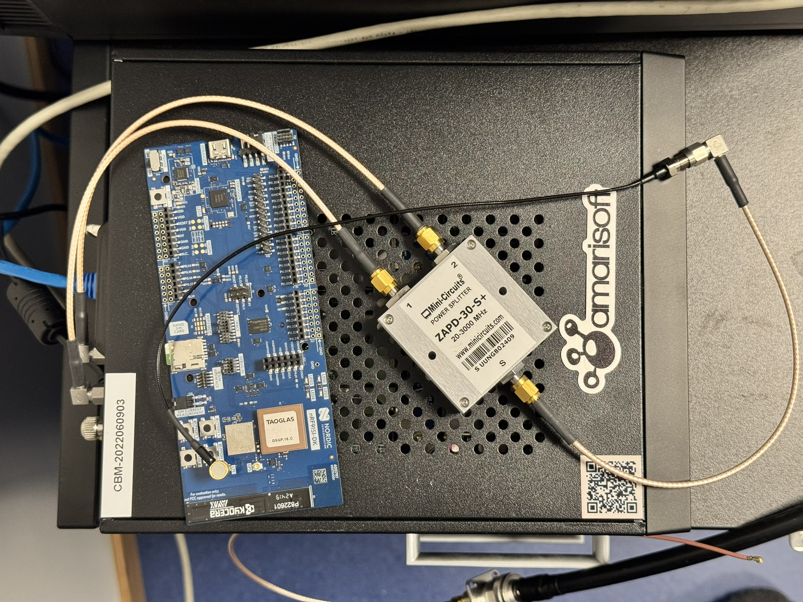

# Getting Started with nRF9151 in LTE NTN Mode: Integrating with the Amarisoft Callbox for Satellite IoT Connectivity

NTN (Non‑Terrestrial Networks) was introduced in 3GPP Release 17 to integrate satellites into cellular networks, enabling global coverage for low‑power devices. Several vendors are already providing commercial NTN services.

Nordic Semiconductor’s nRF9151 SiP is a low‑power cellular IoT device with LTE‑M/NB‑IoT and NTN support, integrated GNSS, and an NTN‑capable modem.

The Amarisoft Callbox is a versatile SDR‑based network emulator for simulating cellular networks, including NTN environments. It supports satellite‑relevant bands such as S‑band and L‑band for laboratory testing.

## Purpose

The purpose of this document is to provide step‑by‑step instructions for bringing up an nRF9151‑based development kit with an Amarisoft Callbox in LTE NTN mode. The focus is on practical setup and testing rather than detailed theory.

Development and testing of NTN‑based applications can be slow, time‑consuming, and expensive when using live satellite networks. Emulated systems such as the Amarisoft Callbox can significantly accelerate and de‑risk the development process.

## Scope

This guide covers basic NTN connectivity in S‑band. It does not cover advanced features such as multi‑constellation handover, roaming between terrestrial and non‑terrestrial networks, or production deployment.

In this document, the nRF9151 DK connects to the Amarisoft Callbox in a geostationary (GEO) satellite configuration. Low Earth Orbit (LEO) modes are also supported by the Callbox, but are not covered here.

## Target Outcome

By the end of this guide, you will be able to:

- Establish an NTN cellular link between the nRF9151 DK and the Amarisoft Callbox
- Verify bidirectional IP data transfer over this link (DNS resolution and UDP traffic)

## Audience

This document targets engineers familiar with:

- Embedded systems and RTOS‑based development
- LTE/LTE‑M/NB‑IoT and basic NTN concepts
- Linux command‑line environments

# System Requirements

## Hardware Requirements

| Hardware Component                      | Version            |
|-----------------------------------------|--------------------|
| NTN capable nRF9151 DK (SMA variant)    | v1.2.0 ++          |
| Amarisoft Callbox                       | Classic / Mini     |
| 2-way RF combiner (800-2500MHz)         | Single cell setup  |
| SMA cables                              |                    |
| Development PC                          | Win/Linux/Mac      |

The main difference between Amarisoft Callbox variants is the number of simultaneously supported cells, which is determined by the number of SDR radios built into the unit.

For NTN testing, a 3‑cell Callbox variant (currently sold as the ‘Amarisoft Classic’) is often useful. Many applications will need to:

- Connect to both NTN and terrestrial (TN) networks
- Test both LTE‑M (Cat‑M1) and NB‑IoT
- Evaluate different combinations of LEO and GEO satellite scenarios

## Safety and Regulatory Notes

RF exposure and regulatory warnings:

- Ensure your lab environment complies with applicable RF exposure regulations (for example, FCC/IC limits).
- For this setup, use coaxial RF connections or operate the hardware inside an RF shielded enclosure.
- Do not run the Callbox with antennas in open air; this may interfere with local commercial cellular networks.

# Hardware Setup

## Unbox and Connect

- 2 × SMA cables from the Callbox RF ports to the RF combiner
- 1 x SMA cable from the RF combiner to nRF9151DK LTE external antenna connector
- Power and ethernet to Amarisoft Callbox
- USB from nrf9151dk to development PC
- The Callbox is delivered with test SIM cards. Insert one test SIM into the SIM slot on the nRF9151 DK.

## Power Up

- Power on Amarisoft Callbox
- Connect the nRF9151 DK to the development PC via USB

# Configuring Amarisoft Callbox

## SSH

It is recommended to work on the Amarisoft Callbox via SSH from the development PC. To keep things simple we log in as root and perform all operations as root.
 
## Install Software Update

First download the latest software from the Amarisoft customer portal (https://extranet.amarisoft.com), then copy the tarball to the callbox and extract.

At time of writing `amarisoft.2025-09-19.tar.gz` was the latest release, and it was used to write this guide. Future releases might work differently.

Example: 
```
scp ~/Downloads/amarisoft.2025-09-19.tar.gz root@<amarisoft ip addr>:/tmp
ssh root@<amarisoft ip addr>
tar xf /tmp/amarisoft.2025-09-19.tar.gz
```
This creates a 2025-09-19 folder. `cd 2025-09-19` and run `./install.sh`.

For a default lab setup, you can answer ‘yes’ to all prompts. After installation, a reboot may be requested; perform the reboot so the updated SDR firmware is loaded.

### eNodeB Configuration

The configuration file we are interested in is located here: `/root/enb/config/enb.cfg`

This file controls the LTE/NTN cell configuration used by the Callbox eNodeB process.

This is a symbolic link to one of the files in `/root/enb/config/`. These files have descriptive names, like enb-nbiot-catm1.cfg representing a configuration with one Cat-M1 cell and one nb-iot cell.

The file we want to use is this one: `enb-nbiot-ntn.cfg`

To activate it, make the symbolic link `enb.cfg` point to `enb-nbiot-ntn.cfg`:

    # rm -f enb.cfg
    # ln -s enb-nbiot-ntn.cfg enb.cfg

To make this work with nRF9151 DK we need to make some small modifications to this file, so make a backup of `enb-nbiot-ntn.cfg` first.

Edit the file and locate the lines below:

    /* Uncomment based on UE interpretation of the ECI reference frame */
    /* eci_reference: "ecef_greenwich" */
    ground_position: {

Now uncomment the line containing "eci_reference" so it becomes like below. Note the trailing comma at the end of the eci_reference line; this is required for proper JSON‑style syntax:

    /* Uncomment based on UE interpretation of the ECI reference frame */
    eci_reference: "ecef_greenwich",
    ground_position: {

Next enable "use_state_vectors", find the lines below:

        default_ephemeris: "geo",
        /* Send orbital data in the form of ECEF state vectors, only relevant in GEO */
        /* use_state_vectors: true, */
    #elif NTN_MODE == 1
        ul_sync_validity: 20,

Uncomment as follows:

        default_ephemeris: "geo",
        /* Send orbital data in the form of ECEF state vectors, only relevant in GEO */
        use_state_vectors: true,
    #elif NTN_MODE == 1
        ul_sync_validity: 20,


Also make note of the following section of this config file:

    /* This should reflect the actual UE position in order to simulate properly the service link delay */
    ue_position: {
        latitude: 43.295,
        longitude: 5.373,
        altitude: 20
    },
    ue_doppler_shift: true,


This is the expected location of the nRF9151 DK. The latitude, longitude, and altitude values must be configured both in this file and in the nRF9151 modem firmware (via AT%LOCATION) so the modem and Callbox agree on delay and Doppler parameters.

### RF Driver Config

As we use a direct coaxial connection (no significant path loss), we must reduce the RF gains to avoid receiver saturation.

Make the following modifications to `/root/enb/config/rf_driver/config.cfg`:

    tx_gain: 90.0, /* TX gain (in dB) */
    rx_gain: 60.0, /* RX gain (in dB) */


Change the gain values to 60 and 0 dB like this:

    tx_gain: 60.0, /* TX gain (in dB) */
    rx_gain: 0.0, /* RX gain (in dB) */


After changing the configuration, restart the LTE service:

    systemctl restart lte.service


## Hardware connection

Connect the nRF9151DK to the coaxial SDR ports on the callbox using appropriate cables via an RF combiner, as shown in picture below:



Consult the User Guide for your callbox for details on connection setup. Note that the RF combiner is required as the callbox has radio TX and RX on different SMA connectors, and the nRF9151 DK only has one connector for both.

# nRF9151 Development Kit

| Software Required      | Link
|------------------------|-------------------
| nrfutil                | https://www.nordicsemi.com/Products/Development-tools/nRF-Util/Download?lang=en#infotabs
| Modem Firmware NTN     | Awaiting public release
| Modem Shell            | Awaiting public release
| Serial Modem           | [nrf9151dk_mfw-2.0.2_sdk-3.1.0.zip](https://nsscprodmedia.blob.core.windows.net/prod/software-and-other-downloads/dev-kits/nrf9151-dk/application-firmware/nrf9151dk_mfw-2.0.2_sdk-3.1.0.zip) (latest release at time of writing)

Note: The filenames and versions used in this document are examples. Refer to Nordic’s download pages for the latest NTN modem firmware and modem shell images compatible with your nRF9151 DK revision.

Download all the software from the table to the development PC.

## nrfutil

`nrfutil` is a single binary you can run from anywhere. The examples assume `nrfutil` is available in your PATH. 

Run the following commands to download the *device* command we will use to load firmware onto the nRF91DK:

    nrfutil self-upgrade
    nrfutil install device

Run the following command after connecting your nRF9151DK via USB and observe output similar to below:

    ~$ nrfutil device list

    1051286708
    Product         J-Link
    Board version   PCA10171
    Ports           /dev/ttyACM0, vcom: 0
                    /dev/ttyACM1, vcom: 1
    Traits          jlink, devkit, seggerUsb, modem, boardController, usb, serialPorts

    Supported devices found: 1
    $> _

If you see output similar to above your device is operating correctly.

## Modem Firmware NTN

From here on, commands assume only one DK connected. If more than one is connected, specify device with `--serial-number` parameter.

Load the NTN-enabled modem firmware onto the nRF9151 DK:

    nrfutil device program --firmware path/to/mfw_nrf91x1_ntn-0.5.0.zip

Note: Replace the firmware path and version with the actual NTN modem firmware file provided by Nordic.

# Applications

## Modem Shell Application

Load the NTN enabled modem shell application:

    nrfutil device program --firmware nrf9151_mosh_ntn_0.1.hex

On the development PC use your favorite terminal emulator and connect to your nRF9151 DK:

    minicom /dev/ttyACM0

Make sure your terminal is configured with the following settings:
- Baud rate: 115200
- 8 data bits, no parity, 1 stop bit (8N1)

Note that development kits usually have multiple ports, but normally the first one is used for application logs.

Press the reset button and you should see output similar to below:

    *** Booting nRF Connect SDK v3.1.99-4102a1851515 ***
    *** Using Zephyr OS v4.2.99-28a66c459624 ***

    Reset reason: software

    mosh:~$
    MOSH version:       v3.1.99-4102a1851515
    MOSH build id:      v125
    MOSH build variant: development/normal_ext_antenna_modem_uart_trace_v125
    HW version:         nRF9151 LACA APA
    Modem FW version:   mfw_nrf9151-ntn_0.5.0
    Modem FW UUID:      4a69a961-c52c-4a1c-8d78-c517a28eafa3


    Network registration status: searching
    Currently active system mode: LTE-M

    mosh:~$ _

This application has a terminal interface. To enable NTN connectivity we need to type the following commands into the terminal:

    link funmode -0             # Set UE to minimum functionality (CFUN=0 equivalent)
    at AT%CELLULARPRFL=2,0,4,0
    at AT%CELLULARPRFL=2,1,1,0
    link sysmode --ntn          #  Set system mode to NTN
    at AT%LOCATION=2,\"43.295\",\"5.373\",\"20\",0,0  # Set UE location (must match enb ue_position)
    at AT+CPSMS=0
    link funmode -1             # Return to full functionality (CFUN=1 equivalent)

If you changed the lat/lon values in the Amarisoft enb config file, adjust your `AT%LOCATION` command accordingly.

Within a minute the device should now establish connection:

    Network registration status: searching
    Currently active system mode: NTN NB-IoT
    LTE cell changed: ID: 27447554, Tracking area: 2
    Modem domain event: CE-level 0
    RRC mode: Connected
    PDN event: PDP context 0 activated
    PDN event: PDP context 0, PDN type IPv4 only allowed
    Network registration status: Connected - home network
    Modem domain event: Search done
    PSM parameter update: TAU: 1800, Active time: -1 seconds
    Modem config for system mode: NTN NB-IoT
    Modem config for LTE preference: No preference, automatically selected by the modem
    Battery voltage:       5128 mV
    Modem temperature:     24 C
    Device ID:             50423451-3737-406f-80f9-0f154bb7b53d
    Operator full name:   "Amarisoft Network"
    Operator short name:  "Amarisoft"
    Operator PLMN:        "00101"
    Current cell id:       27447554 (0x01A2D102)
    Current phy cell id:   37
    Current band:          255
    Current TAC:           2 (0x0002)
    Current rsrp:          88: -53dBm
    Current snr:           45: 21dB
    Mobile network time and date: 25/10/01,13:05:07+08
    PDP context info 1:
        CID:                0
        PDN ID:             0
        PDP context active: yes
        PDP type:           IP
        APN:                default
        IPv4 address:       192.168.2.2
        IPv6 address:       ::
        IPv4 DNS address:   8.8.8.8, 0.0.0.0
        IPv6 DNS address:   ::, ::
    RRC mode: Idle

Now we are connected to GEO emulated satellite. Check if a DNS request works:

    mosh:~$ sock getaddrinfo -H google.com
    getaddrinfo query family=0, type=0, pdn_cid=0, hostname=google.com
    getaddrinfo answer family=1, address=142.250.74.78
    RRC mode: Idle
    mosh:~$ _

Check that you can send and receive UDP data to a known server. For example:

    sock connect -I 0 -a 95.217.154.188 -p 21185 -t dgram
    sock send -i 0 -d somebytesofdata

If you point this at a UDP echo server, you should see your payload echoed back:

    mosh:~$ sock send -i 0 -d somebytesofdata
    Socket data send:
            somebytesofdata
    Received data for socket socket_id=0, buffer_size=15:
            somebytesofdata

# Serial Modem

Unzip the firmware package downloaded from the nRF9151DK product page.

    unzip nrf9151dk_mfw-2.0.2_sdk-3.1.0.zip

Load the serial modem application from the extracted package:

    nrfutil device program --firmware img_app_bl/nrf9151dk_serial_lte_modem_2025-08-14_6c6e5b32.hex

On the development PC use your favorite terminal emulator and connect to your nRF9151 DK:

    minicom /dev/ttyACM0

Upon reset of the nRF9151DK the application should print the string `Ready` to the serial terminal.

Currently, the serial modem requires a full CRLF (carriage return + line feed) sequence at the end of AT commands. Ensure your terminal is configured to send both \r and \n when you press Enter.

Typing in the string `AT\r\n` should return the string `OK`.

Note that this application does not echo characters back, like modem_shell did above.

After running the following AT commands, the device should be connected to the callbox:

    AT+CFUN=0
    AT%CELLULARPRFL=2,0,4,0
    AT%CELLULARPRFL=2,1,1,0
    AT%XSYSTEMMODE=0,0,0,0,1
    AT%LOCATION=2,"43.295","5.373","20",0,0
    AT%XBANDLOCK=2,,"256"
    AT+CPSMS=0
    AT+CFUN=1

Now you should be able to run the AT command `AT+CGDCONT?` and get output indicating we are connected and have IP address from callbox:

    +CGDCONT: 0,"IP","test123","192.168.3.2",0,0
    OK

Now SLM AT commands should work, running `AT#XGETADDRINFO="www.google.com"` shoud return something like:

    OK
    #XGETADDRINFO: "216.58.207.228"

# Summary

You now have a working NTN connection between the nRF9151 DK and the Amarisoft Callbox.

With a suitable NTN‑capable SIM card, the same configuration steps (modem firmware, system mode, location, and APN setup) can be adapted to connect to a live NTN satellite network instead of the emulated Callbox environment.

The Callbox also provides a web GUI at:
http://<callbox ip>/
where you can monitor logs, cell configuration, and connected devices.

# Versioning

This document was tested with:
- Amarisoft release: 2025-09-19
- nRF Connect SDK: 3.1.0
- NTN modem firmware: mfw_nrf9151‑ntn_0.5.0

Future releases may change configuration file names and paths; consult the latest vendor documentation if something differs.